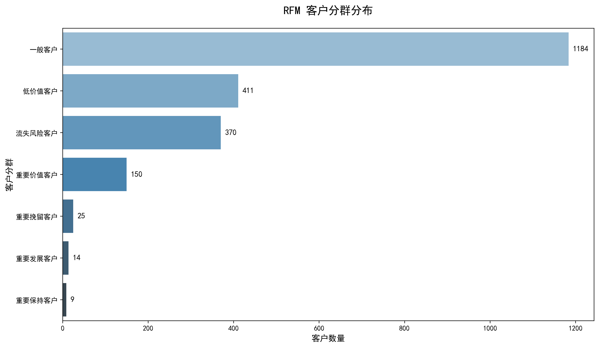

这个仓库用来存放我的一些小练习和小项目。目前做的小项目有实时检测车辆系统以及一个电商分析的小项目。
关于电商分析小项目。
# 数据分析项目作品集 | Online Retail 电商数据

这是我的数据分析学习作品集，包含多个端到端实战项目。

## 项目列表

### 1. 电商销售全景分析（Sales Overview）
- **内容**：销售 KPI 分析、国家分布、时间趋势、热销商品分析
- **技术**：SQL 数据清洗、可视化（Python）
- [查看详细报告 →](./Project1_Sales_Analysis/README.md)

**关键成果**：
- 发现英国占 88% 销售额
- 识别热销品类和季节性规律

---

### 2. RFM 客户分群分析（Customer Segmentation）
- **内容**：基于 RFM 模型进行客户价值分群及运营策略建议
- **技术**：SQL（NTILE 分箱 + 分群逻辑）、Python 可视化
- [查看详细报告 →](./Project2_RFM_Segmentation/README.md)

**关键成果**：
- 识别出 **重要价值客户**（仅占 6.93%，贡献极高收入）
- 提出差异化运营策略（VIP维护、挽留唤醒等）

---

## 技术栈
- SQL（MySQL）：数据清洗、聚合分析、窗口函数
- Python：Pandas、Matplotlib、Seaborn
- 工具：Navicat、Jupyter Notebook

## 项目收获
- 掌握了从数据理解 → 清洗 → 分析 → 可视化 → 业务建议的完整流程
- 学会使用 RFM 模型进行客户分层运营
- 提升了业务思维和数据故事化能力

## 联系方式
- 欢迎交流与指导！